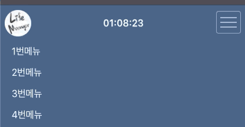

# MainHeaderBar-Menu

## 기능

메뉴 목록을 보여준다.   
초기상태는 숨겨져 있는 상태, MenuButton을 클릭하면 메뉴 목록을 보여주도록 한다.  

## 구현 방안

### 방안 1 - success 

MainHeaderBar 단계에 위치. MenuButton이 눌린 이벤트 발생 시 MainHeaderBar에서 인지하고 해당 컴포넌트를 생성한다.  
다시한번 메뉴 버튼이 눌리거나 닫히는 것이 적절해보이는 상황이 발생 시 숨김 상태로 전환한다. (or Component 삭제)

### 방안 2

Button단계에서 이벤트 발생 시 아래에 새로운 컴포넌트 생성한다.

### 추가기능 : css transition 적용을 위해. 

기존 컴포넌트 생성, 삭제를 이용하면 transition이 먹지 않는다. 
생성하고 class를 통해 display: none을 한 후, 버튼 상태에 따랄 class를 추가제거하는 방식으로 transition 적용을 위한 css를 구성할 수 있도록 수정하자.

### 메뉴 버튼으로 메뉴 창 on / off 하기


```jsx
state = {
    menuClicked: false
  }

  handleToggleMenuClicked = () => {
    this.setState({
      menuClicked: !this.state.menuClicked 
    })
  }
  
  render() {
    return (
      <div className="MainHeader">
        <div className="MainHeaderBar">
          </img>
          <CentorClock></CentorClock>
          <MenuButton onClick={this.handleToggleMenuClicked}></MenuButton>
        </div>
        {this.state.menuClicked ? <Menu></Menu> : ''}
      </div>
    );
  }
```

menu On Off 상태 표시를 위한 menuClicked 속성 추가. 

handleToggleMenuClicked함수를 통해 menuClicked 상태 관리. 

이 method를 MenuButton의 onClick props로 전달.

```jsx
class MenuButton extends Component {
  render() {
    return (
      <div className="MainHeaderBar-MenuButton">
        </img>
      </div>
    );
  }
}
```

메뉴 버튼에서 props로 받은 method를 통해 상태 관리.

한계. component 생성, 제거를 통해 구현해서 css transition적용에 제한이 있다.

## transition적용을 위해 구성 변경

기존 컴포넌트 생성, 삭제를 이용하면 transition이 먹지 않는다.
생성하고 class를 통해 display: none을 한 후, 버튼 상태에 따라 class를 추가제거하는 방식으로 transition 적용을 위한 css를 구성할 수 있도록 수정하자.

### 결과



### css변경

```jsx
.MainHeaderMenu {
    background-color:$headerMainColor;
    padding: 0px 20px;
    transition: padding 0.5s, height 0.5s;
    height: 150px;

    .MainHeaderMenu-MenuContent {
      padding:10px 0px !important;
      & a {
        display:block;
      }
      & :hover {
        font-weight: 600;
      }
      cursor:pointer;
      
    }
  }
}

.hidden {
  padding-top: 0px !important;
  padding-bottom: 0px !important;
  height:0px !important;
}
```

Transition 적용하는데 height값을 지정해주지 않으면 적용되지 않았다.

height 150px은 100%로 하고 싶었지만 100%일 때 동작하지 않았다. 

!important는 MainHeaderMenu와 hidden클래스가 같이 들어갔을 때, 우선순위가 hidden이 밀렸다 (css설정의 문제로 hidden은 좀 더 전역의 느낌이고 mainheadermenu 클래스는 더 상세해서 우선순위가 밀려서 적용이 안됐다. 그래서 important 키워드로 우선순위를 높여 적용했다.